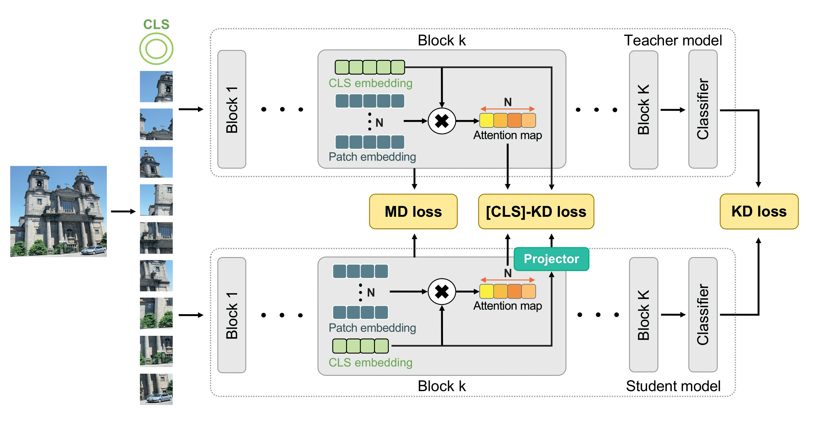

# Adaptive class token knowledge distillation for efficient vision transformer

## Implementation of the Knowledge-Based Systems 2024 paper: [Adaptive class token knowledge distillation for efficient vision transformer](https://www.sciencedirect.com/science/article/pii/S0950705124011651).

## Introduction

We propose [CLS]-KD, an adaptive knowledge distillation method for vision transformers that leverages class tokens and CLS-patch attention maps to enhance performance.



## Usage

### Requirements

```
pytorch==1.8.0
timm==0.5.4
```
### Data preparation

Download and extract ImageNet train and val images from http://image-net.org/.
The directory structure is:

```
│path/to/imagenet/
├──train/
│  ├── n01440764
│  │   ├── n01440764_10026.JPEG
│  │   ├── n01440764_10027.JPEG
│  │   ├── ......
│  ├── ......
├──val/
│  ├── n01440764
│  │   ├── ILSVRC2012_val_00000293.JPEG
│  │   ├── ILSVRC2012_val_00002138.JPEG
│  │   ├── ......
│  ├── ......
```

### Training on ImageNet-1K

To train a DeiT-Tiny student with a DeiT-Base teacher, run:

```shell
python -m torch.distributed.launch --nproc_per_node=4 main.py --distributed --output_dir <output-dir> --data-path <dataset-dir> --teacher-path <path-of-teacher-checkpoint> --model deit_tiny_patch16_224 --teacher-model deit_base_patch16_224 --distillation-type soft --distillation-alpha 1 --distillation-beta 1 --manifold --w-cls 1.0 --w-atn 2.0 --last-w 4.0 --K 192 --s-id 0 1 2 3 8 9 10 11 --t-id 0 1 2 3 8 9 10 11 --drop-path 0 --batch-size 128 --seed 0
```

**Note:** pretrained `deit_base_patch16_224` model can be download from [deit](https://github.com/facebookresearch/deit/blob/main/README_deit.md).

### Test on ImageNet-1K
To test a DeiT-Tiny student with a DeiT-Base teacher, run:

```shell
python main.py --eval --output_dir <output-dir> --data-path <dataset-dir> --teacher-path <path-of-teacher-checkpoint> --model deit_tiny_patch16_224 --teacher-model deit_base_patch16_224 --distillation-type soft --distillation-alpha 1 --distillation-beta 1 --manifold --w-cls 1.0 --w-atn 2.0 --last-w 4.0 --K 192 --s-id 0 1 2 3 8 9 10 11 --t-id 0 1 2 3 8 9 10 11 --drop-path 0 --resume <path-of-distilled-model>
```

### Result

| Teacher  | Student   | Acc@1 | Checkpoint & log                                             |
| -------- | --------- | ----- | ------------------------------------------------------------ |
| DeiT-Base | DeiT-Tiny | 75.1  | [checkpoint](https://github.com/kmc3661/cls-kd/releases/download/checkpoint/deit_base_to_tiny_75.1.pth) / [log](https://github.com/kmc3661/cls-kd/releases/download/checkpoint/deit_base_to_tiny_75.1.txt) |
| DeiT-Base | DeiT-Small | 81.49  | [checkpoint](https://github.com/kmc3661/cls-kd/releases/download/checkpoint/deit_base_to_small_81.49.pth) / [log](https://github.com/kmc3661/cls-kd/releases/download/checkpoint/deit_base_to_small_81.49.txt) |


## Citation

If you find this project useful in your research, please consider cite:

```
@article{Kang2024clskd,
title = {Adaptive class token knowledge distillation for efficient vision transformer},
author = {Minchan Kang and Sanghyeok Son and Daeshik Kim},
journal = {Knowledge-Based Systems},
volume = {304},
pages = {112531},
year = {2024},
publisher={Elsevier}
}
```

## Acknowledgment

This repo is based on [DeiT](https://github.com/facebookresearch/deit), [manifold-distillation](https://github.com/Hao840/manifold-distillation) and [pytorch-image-models](https://github.com/rwightman/pytorch-image-models).

## Contact
Email : mc.kang@kaist.ac.kr
